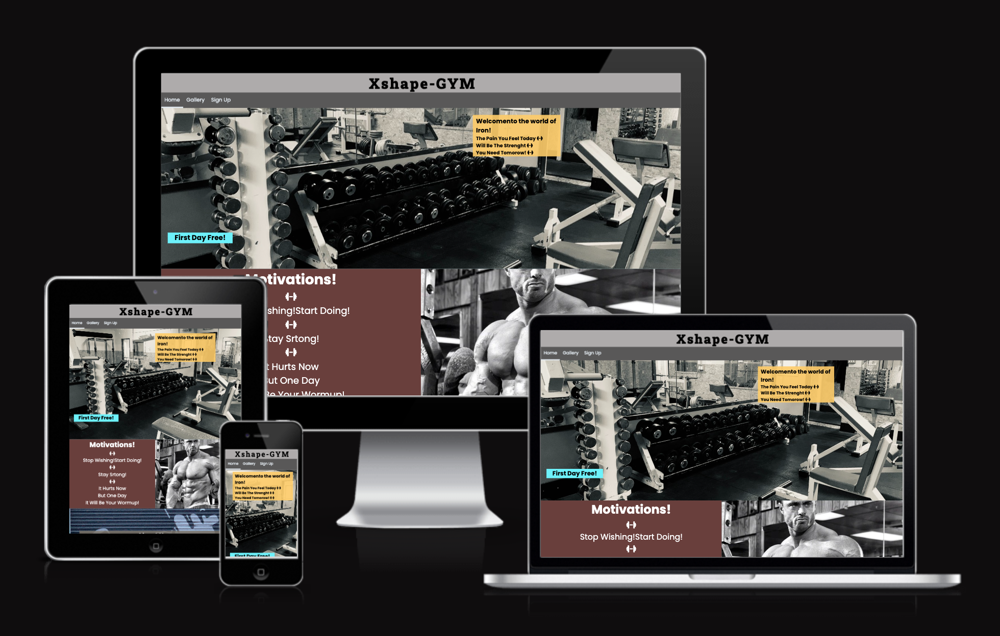
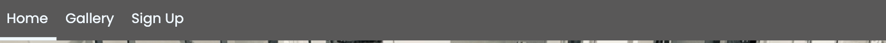
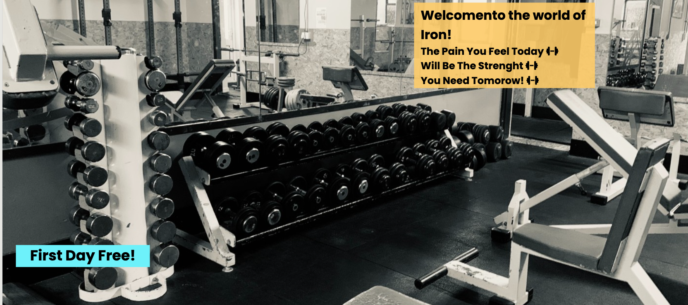
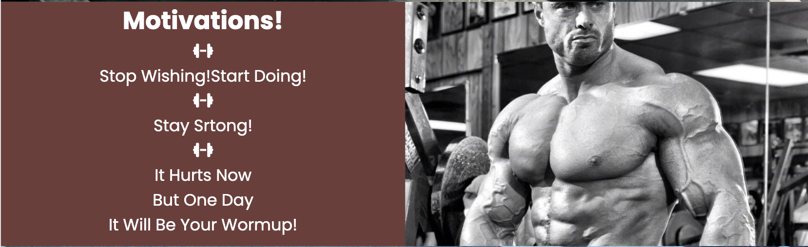
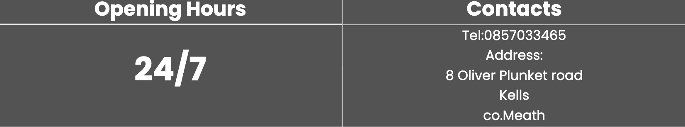
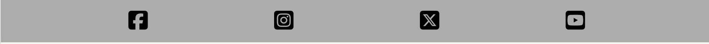
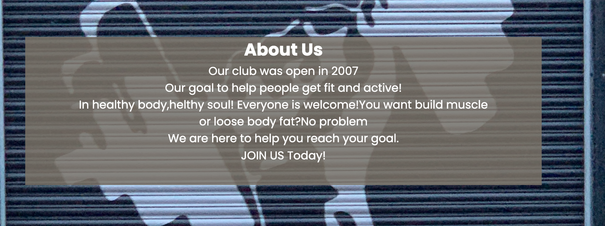
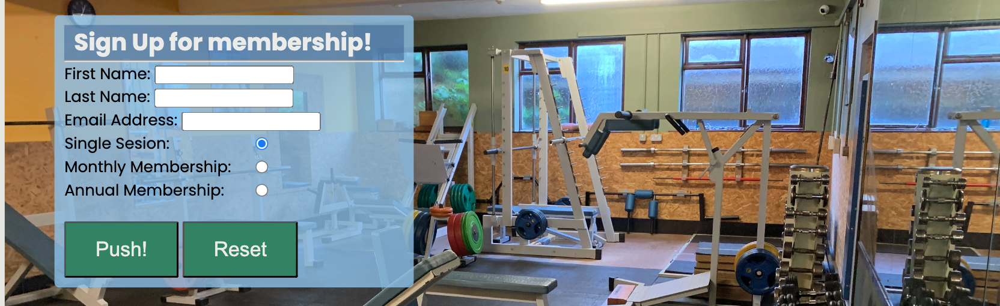
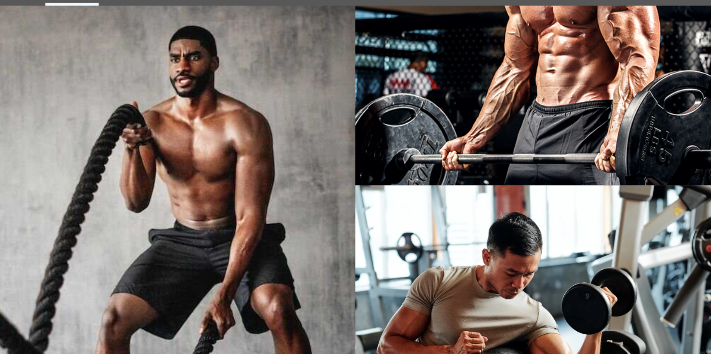

# Xshape-GYM
Welcome to the Xshape-GYM website repository. This project is a comprehensive website for the Xshape-GYM located in Kells, Ireland. It provides information about the gym's facilities, mission, opening hours, and includes a photo gallery.
Xshape-GYM website is designed to provide current and prospective members with all the necessary information about the gym. It includes an About Us section, opening hours, and a gallery showcasing the gym's facilities.

## Preview

* [link to mockup](https://ui.dev/amiresponsive?url=https://glk3.github.io/Gediminas-Luksevicius-Xshape-GYM/)
* [Link to Xshape-GYM page](https://glk3.github.io/Gediminas-Luksevicius-Xshape-GYM/)

## Features
* This website should atract people whowant to get fit.
* Website has:
* Home Page: On the home page you can find name of the gym.Nav bar to other pages like gallery, about us and sign up.Background image of gym facilities.Motivation section, with motivation phrases and picture.Opening hours and contacts.Footer with links to social media websites.
* Gallery: Photo gallery of gym facilities and some exercise in action.
* About Us: Page with some text contest about gym.
* Sign Up: Page with background image of gym facilities and form to sign up for membership.

## Nav bar
* Gives opportunity to navigate true different pages.White underline shows on what page you are.

## The header page
* Contains image with gym facilities.Weights and other equipment.Dumbbells,benches barbell weights.
* Also have welcome text with some motivation phrases and a little lower text that says that first day is free.Jus to try.

## Motivation
* Have some text with motivation phrases and image with muscular athlete body to show how you can look if you start training.

## Opening hours and Contacts
* Shows opening days and time.24/7 Open 7 days a week and 24 hours a day.
* Contacts show address and telephone number.

## Footer
* Contains links to social media.

## About us page

* On this page people can read about our gym.And our mission.
* Have background image "wrists holding a dumbbell" that shows the strength.And some text about club.

## Sign Up page
* This page created for people to sign up for membership or just use single sesion.
* Have background image of gym facilities.And form to fill out for membership.

## Gallery

* Photos of this page should motivate people to start exercise.Images shows what result they can achieve if they start exercising.
* Contains photos of facilities and members working out.

## Technologies Used

* HTML [HTML5](https://en.wikipedia.org/wiki/HTML5)
* CSS [CSS3](https://en.wikipedia.org/wiki/CSS)
* [Mockup picture](https://ui.dev/amiresponsive)
* Mockup picture for the README.md file.

## Testing

* Used google browser,safari and microsoft edge to test website.
* Dev tool was used to inspect different screen sizes.
* Used different type of gadgets like desktop,ipad,samsung tablet,iphone xs max,iphone se to test website.

## Validator testing
* Was used for HTML [W3C Markup Validtor](https://validator.w3.org/)
* Was used for CSS [W3C CSS Validator](https://jigsaw.w3.org/css-validator/)

## Dev tool Lighthouse report
* [Front page](assets/images/main_page_lighthouse.png)
* [Gallery](assets/images/gallery_lighthouse.png)
* [Sign-Up](assets/images/signup_lighthouse.png)

## Deployment

* Steps to deply are:
* Locate repository (glk3/Gediminas-Luksevicius-Xshape-GYM) in Github.
* Open repository and select "settings" on menue.
* On left handside in "General" menue on "Code and automation"section go to option "Pages".
* Under "Branch", click the dropdown menu "None" and select "Main" and click "Save".
* Scroll down the page and check on the right hand side for "Deployments".
* Click on "Deployments" to see your new website link.

## Future features
* Could be added food supplement shop.
* Customer reviews and suggestions page.
* Prices for membership.
* On gallery page could be created  possibility to upload photos with the achieved results.

## Credits

### Code

* Lerning HTML element and CSS rules from W3school [W3School](https://www.w3schools.com/html/default.asp)
* The README.md was provided by Code Institute.[Code Institute (template)](https://github.com/Code-Institute-Solutions/SampleREADME)

### Content

* All code created by my self.
* Footer idea taken from Coding institute studying material.Jus added different shape icons from [Font Awesome](https://fontawesome.com/).

### Media
* All photos taken from google open source pages.And was used just for study purposes.
* Front page image was used from my own photo library.Photos taken in local gym.
* Motivating phrase taken from google search.
* Motivation section.Motivating phrases taken from google search and photo of my favorite body builder from google too.
* About us section.Background image taken by me from local gym.Text created by my self.Just added adage that i remember long time a go."In healthy body,healthy soul"

## Acknowledgements

* Code Institute for providing valuable learning material.
* Mentor Mitko Bachvarov for helpful guidens and valuable information.
* Cohort Fcilitator for advices,links to studying material and motivation.